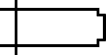

# Draten



Draten is a 2D esoteric programming language.

It uses 26 unbounded, non-negative integer registers, each referenced by a letter of the English alphabet. Uppercase letters increase the value of the registers, while lowercase letters decrease the value of the registers, unless the register is already zero.

Program execution begins with the instruction to the right of the starting symbol `➧`. 

By default, execution proceeds to the right.

The program flows through wires made of box-drawing characters: `━`, `┃`, `┏`, `┓`, `┗`, `┛`.

The program can branch using one of the following instructions if the value of the register is zero: `┣`, `┫`, `┳`, `┻`.

Wires that are out of reach or other unrecognized symbols are ignored as no-ops.

| Unicode | Symbol | Meaning |
| ------- | ------ | ------- |
| U+27A7  | `➧`    | program start |
| U+2501  | `━`    | horizontal wire |
| U+2503  | `┃`    | vertical wire | 
| U+250F  | `┏`    | up to right or left to down |
| U+2513  | `┓`    | right to down or up to left |
| U+2517  | `┗`    | down to right or left to up |
| U+251B  | `┛`    | right to up or down to left |
| U+2523  | `┣`    | branching right |
| U+252B  | `┫`    | branching left |
| U+2533  | `┳`    | branching down |
| U+253B  | `┻`    | branching up |
| U+2191  | `A-Z`  | increment |
| U+2193  | `a-z`  | decrement |

## Examples

Empty program:
```
➧
```

Infinite loop:
```
➧━━┓
 ┗━┛
```

Copy A to B:
```
 ┏━━━┓
➧┳aBC┛c
 a   ┏┻cA┓
 ┗━━━┛┗━━┛
```

Switch A and B:
```
 ┏━━┓┏┓  c
➧┳aC┛b┗━━┻cB┓
 a  ┏┻bA┓┗━━┛
 ┗━━┛┗━━┛
```

Addition (A = A + B):
```
 ┏━━┓
➧┳bA┛
 b
```

Multiplication (C = A × B)
```
 ┏━━━━━━━━━━━┓
 ┃ ┏━━━┓ ┏━━┓┃
➧┳a┳bCD┛┏┳dB┛┃
 a b┏━━━┛d┏━━┛
   ┗┛    ┗┛
```

Hello World (' ' => 1, 'd' => 2, 'e' => 3, 'H' => 4, 'l' => 5, 'o' => 6, 'r' => 7, 'W' => 8):
```
KKJJJJJIIIIIIIHHHHHHGGGGGGGG┓  
   ➧AAAABBBCCCCCDDDDDEEEEEE┓┃    ┏━━┓        ┏F┓
                           ┃┃    ┃┏┓┗┓  ┏┓  ┏┛┏┛
                           ┃┗━━━━┛┃┗┓┗┓┏┛┗┓┏┛┏┛
                           ┃┏━━━━┓┃ ┗┓┗┛┏┓┗┛┏┛
                           ┃┃    ┃┃  ┗┓┏┛┗┓┏┛
                           ┗┛    ┗┛   ┗┛  ┗┛
```

## JavaScript interpreter
```
npm i draten
```
```js
const turmin = require('draten')

const result = draten(`
     ┏━━┓
    ➧┳bA┛
     b
`, 42, 13)
result[0] // 55
```
## License

[MIT](LICENSE)
